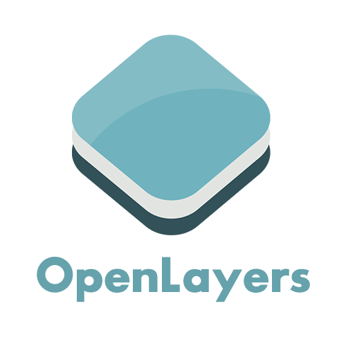

# Planmap-App

The Planmap app is an web interface to explore (_e.g._, morphological) maps
of Mercury, Mars and the Moon.
The webapp displays data in an interactive canvas where the user will
discover general properties of the datasets and eventually access the
complete/science data through either OGC services or directly downloading it.

For information about the backend services, see the [planmap-app-server] repository.

The client app uses [OpenLayers] to display the geological maps.
The code is built using the Meteor/BlazeJS framework and Bootstrap.

[planmap-app-server]: https://github.com/planmap-eu/planmap-app-server
[openlayers]: https://openlayers.org/

Support projects:

